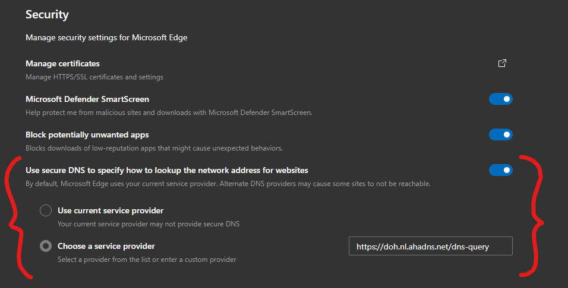

# AhaDNS Microsoft Edge setup guide

We'll guide you through how you enable encrypted DNS-over-HTTPS in Microsoft Edge browser.

1. In Microsoft Edge, open settings.
2. Go to **Privacy, search, and services**.
3. Scroll down to the **Security** section.
4. Enable the _Use secure DNS to specify how to lookup the network address for websites_ option as shown in the image below.
5. Add any AhaDNS DNS-over-HTTPS endpoint in the _Choose a service provider_ box.
   - All DoH endpoints can be found at [hadns.com/dns-over-https/](https://ahadns.com/dns-over-https/)

In the image above, edge will use encrypted DNS-over-HTTPS to the Netherlands server for all DNS requests.
